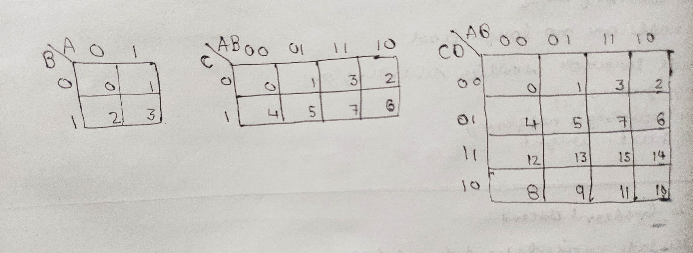
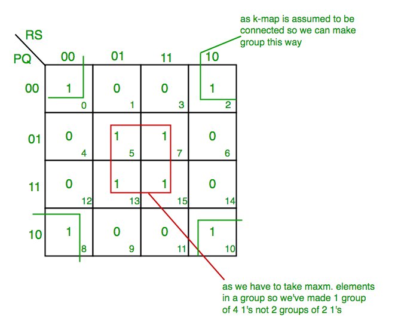
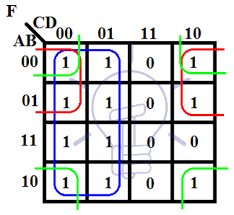
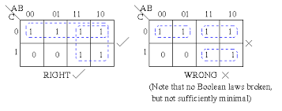
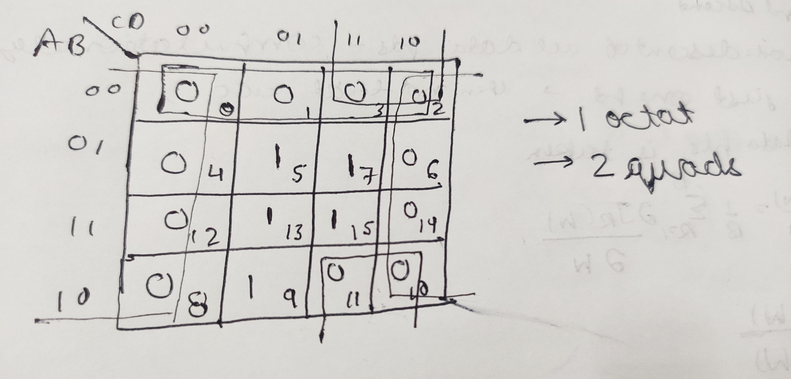

# E-club-handbook
Digital electronics part of E club handbook

# K-Map
The main use of K maps is to simplify or reduce our circuit or to reduce the POS or SOP expression that we have made using logic gates(the ones previously told) and with our input signals thus arriving at the most optimal logic design 

Some of the two variable(input), three variable(input) and four variable(input) K-Maps are:
 

Here note the order of variables-

like for the first one the signal expression would be represented as f(B,A) means the one which is first comes down and the next one up.

Similarly for the 3 variable Karnaugh map which is f(C,A,B), the first one C down and the next two A,B up.Do guess for the fouth one:)

I'm pretty sure you are confused by the order of 0's & 1's written on the top of table and on the side of the table.For now, just learn them up, you will get to know the intuition behind it afterwards.

The use of them is to fill the decimal numbers in the bottom right corner of each block of the table just like as shown:

### Filling and Solving the K-Map

you could be given a circuit as F(A,B,C)=∑(1,3,6,7). So now in all those squares whose number is given in the expression, fill them with 1's and the other with 0's. 

Now we need to make groups of all the 1's if it is a SOP expression and all the 0's if it is a POS expression, but in only groups of the powers of 2 i.e. in (1,2,4,8,16....) and try to make the largest group possible and they should be continuous.

You can make groups in horizontal, vertical and in sideways (making groups of the **extreme left** and the **extreme right** **or** the **top** and the **bottom**)

like for the above example:

Here ,was only the possibility of pairs and no quads as there were no four 1's in line **horizontally**, **vertically** or as a **2x2 rubik's cube**.

Also keep in mind that if all the 1's of a pair or a quad or an octat is used in the foramtion of any other pair,quad, or octat, the former pair, quad or octat becomes **redundant** or **there's no use of it**.

Just like here the pair shown in blue becomes redundant as both of its 1's are used in the formation of two other pairs.

**Congrats** the hard part is now over and now writing the logical expression is left which is pretty easy. Look at the groups that you have formed as only they play a part in expression. In the groups look at the value of the variables A,B,C(Ya, you guessed it right the ones written as the headings). 

Now, look for if value of that variable is changing like from 1 to 0 or from 0 to 1. If it is happening , then that variable will not be taken into the expression. Only those variables will be taken whose value do not change **remains 0 or remains1**.In case of a pair ,one will be lost; for a quad, 2 will be lost ; for an octat,3 will be lost.

For this one , the red pair:  A'.C (as the value of B changes and value of A remains 0, C remains 1).  Since it is a **SOP** expression the value of each variable must be 1 when writing the expression hence complement of A is taken and C as it is + the fact is **SOP** (hence sum of products)

Similarly the green pair will be: A.B (the value of C changes and A:1,B:1)

Hence the reduced expression : A'.C + A.B

#### 4 variable karnaugh map

F(P,Q,R,S)=∑(0,2,5,7,8,10,13,15)

Here the **sideways grouping** is applicable and hence a quad is formed

Green quad: Q'.S'( as the value of P and R changes with respect to the four blocks and the value of Q and S is 0)

Red quad: Q.S

Final expression: Q'.S' + Q.S

##### one more example

F(A,B,C,D):∑(0,1,2,4,5,6,8,9,10,12,13)

Try to this on your own

Final expression: A' + C'.B' + D'.B'

**Tip** : Try to avoid this mistake anywhere as it simply makes the expression more lengthy 

## POS Expression

For the POS expression all the things are same as the SOP expression but instead of 1's, you have to make the groups of 0's and during wriing the expression make sure that every variable's value is 0 , instead of 1 and if not take the complement of that variable. 

### 4 variable POS expression

F(A,B,C,D)=π(0,1,2,3,4,6,8,10,11,12,14)

octat : D (A,B,C changes)
quad : C' + B
quad : A + B

Final Expression : D.(C' + B').(A + B)

