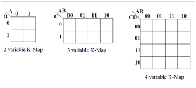

# E-club-handbook
Digital electronics part of E club handbook

# K-Map
The main use of K maps is to simplify or reduce our circuit or to reduce the POS or SOP expression that we have made using logic gates(the ones previously told) and with our input signals thus arriving at the most optimal logic design 

Some of the two variable(input), three variable(input) and four variable(input) K-Maps are:
 

Here note the order of variables-

like for the first one the signal expression would be represented as f(B,A) means the one which is first comes down and the next one up.

Similarly for the 3 variable Karnaugh map which is f(C,A,B), the first one C down and the next two A,B up.Do guess for the fouth one:)

I'm pretty sure you are confused by the order of 0's & 1's written on the top of table and on the side of the table.For now, just learn them up, you will get to know the intuition behind it afterwards.

The use of them is to fill the decimal numbers in the bottom right corner of each block of the table just like as shown:

### Filling and Solving the K-Map

you could be given a circuit as F(A,B,C)=∑(1,3,6,7). So now in all those squares whose number is given in the expression, fill them with 1's and the other with 0's. 

Now we need to make groups of all the 1's if it is a SOP expression and all the 0's if it is a POS expression, but in only groups of the powers of 2 i.e. in (1,2,4,8,16....) and try to make the largest group possible and they should be continuous.

You can make groups in horizontal, vertical and in sideways (making groups of the **extreme left** and the **extreme right** **or** the **top** and the **bottom**)

like for the above example:

Here ,was only the possibility of pairs and no quads as there were no four 1's in line **horizontally**, **vertically** or as a **2x2 rubik's cube**.

Also keep in mind that if all the 1's of a pair or a quad or an octat is used in the foramtion of any other pair,quad, or octat, the former pair, quad or octat becomes **redundant** or **there's no use of it**.

Just like here the pair shown in blue becomes redundant as both of its 1's are used in the formation of two other pairs.

**Congrats** the hard part is now over and now writing the logical expression is left which is pretty easy. Look at the groups that you have formed as only they play a part in expression. In the groups look at the value of the variables A,B,C(Ya, you guessed it right the ones written as the headings). 

Now, look for if value of that variable is changing like from 1 to 0 or from 0 to 1. If it is happening , then that variable will not be taken into the expression. Only those variables will be taken whose value do not change **remains 0 or remains1**.In case of a pair ,one will be lost; for a quad, 2 will be lost ; for an octat,3 will be lost.

For this one , the red pair:  A'.C (as the value of B changes and value of A remains 0, C remains 1).  Since it is a **SOP** expression the value of each variable must be 1 when writing the expression hence complement of A is taken and C as it is + the fact is **SOP** (hence sum of products)

Similarly the green pair will be: A.B (the value of C changes and A:1,B:1)

Hence the reduced expression : A'.C + A.B

#### 4 variable karnaugh map

F(P,Q,R,S)=∑(0,2,5,7,8,10,13,15)

Here the **sideways grouping** is applicable and hence a quad is formed

Green quad: Q'.S'( as the value of P and R changes with respect to the four blocks and the value of Q and S is 0)

Red quad: Q.S

Final expression: Q'.S' + Q.S

##### one more example

F(A,B,C,D):∑(0,1,2,4,5,6,8,9,10,12,13)

Try to this on your own

Final expression: A' + C'.B' + D'.B'

**Tip** : Try to avoid this mistake anywhere as it simply makes the expression more lengthy 

## POS Expression

For the POS expression all the things are same as the SOP expression but instead of 1's, you have to make the groups of 0's and during wriing the expression make sure that every variable's value is 0 , instead of 1 and if not take the complement of that variable. 

### 4 variable POS expression

F(A,B,C,D)=π(0,1,2,3,4,6,8,10,11,12,14)

octat : D (A,B,C changes)
quad : C' + B
quad : A + B

Final Expression : D.(C' + B').(A + B)

## Decoder

A binary code of n bits is capable of representing 2^n coded information which is pretty huge.In terms of numbers a n bit code can represent numbers from -(2^n - 1) to 2^n - 1.

Decoder is a **combinational** circuit that converts binary information from **n input lines** to **2^n output lines**.
It represents the basic calculation of decimal number system from binary number system as mentioned before.

If a binary decoder receives n inputs it activates one and only one of its 2^n outputs based on that input with all other outputs deactivated.

A 3x8 binary decoder looks like this:

 **OR** 

The intuition behind it is that the inputs can be supposed to be diiferent input switches and the output lines could be different LED's, so when a combination of input is given through the switches, only the LED with that combination glows and all the other LED's do not glow.

The truth table is as follows:

  

When enable pin is 0 the circuit is not started and when it is 1, the circuit works in the original way.

Similarly there are 2x4 and 4x16 decoders also.

## Encoder

An encoder performs opposite operation to that of a decoder.It has 2^n or fewer input lines and n output lines.
Output lines generate binary code corresponding to the input values.

Only one input line should be high and corresponding to that a combination of output lines light up or are generated and the other remain low.

for example an octal to binary encoder:  has eight input lines(Y0-Y7) and three output lines(A0-A2)

The truth table for it is as follows:

Since, A0 = Y1 + Y3 + Y5 + Y7    ,   A1 = Y2 + Y3 + Y6 + Y7   ,  A2 = Y4 + Y5 + Y6 + Y7

However ther's one **Anomally** with an encoder which is if all the ouptut lines are 0 , it could be if all the inputs are 0 or the least significant input is 0.

## Sequential Circuits

Sequential circuits are circuits in which the present output depend on the present input as well as the past output/outputs.
Basically, there's a memory element which stores the output and provides that as a feedback or another set of input to its own circuit to generate a new output.The basic difference between the sequential and combinational circuits are these memory blocks.

)

  

You can think of it as a counter which counts from 0 to 9 by adding 1 bit each time. So it adds 0+1=1, 1+1=2, 2+1=3...... and so it should know what the previous digit was or on what to add 1.Thus a memory element stores what the previous digit was.

These memory elements which are capable of storing one bit of information are known as **flip flops**.

Before coming to the flip flops, let's know about **latches** which are the most basic and primitive form of flip flops and used as memory elements.
Certain types of latches are:

  **SR Latch**
  
It is the Set Reset Latch and there are two forms of it using the NOR gate and the NAND gate.  

1. **NOR Latch**

  

  Two cross coupled NOR gates
  
  R:Reset ,S:Set , Q and Q' : Complementary outputs
  
* Q = 1 and Q' = 0 : Set state of the Latch

* Q = 0 and Q' = 1 : Reset state of the Latch

  Recall for NOR gates: any input if 1 will make the output 0 , output will be 1 only if all inputs are 0
  
Now let's look at the different cases:

Now make S = 1 ( keeping R = 0 )
=> Immediately Q' = 0 , and it is fed back to NOR1, which already has one of its input (R) = 0

=> Q = 1 (and Q' = 0 )
=> Set state of the latch

Now if we remove the inputs it should retain the output as it is working as a memory element. Thus making S=0 & R=0 and Q' = 0 will lead to Q remaining as 1 

When Q fed to second NOR it would let Q'=0 thus serving as memory storage.

Now make R = 1 ( keeping S = 0 ) immediately Q = 0 , and it is fed back to NOR2, which already has one of its i/p (S) = 0

=> Q' = 1 (and Q = 0 )

=>**Reset** state of the latch

Thus when now, R = 0 & S = 0, this would make no difference to the output. Hence **memory action**.

When S = 1 and R = 1 both Q = 0 and Q' = 0 irrespective of the previous inputs.

Thus now when S = 0 and R = 0 in memory state since both Q and Q' are 0, it would lead to making either Q or Q' equal to 1 whichever input reached faster the other NOR gate. Thus the purpose of storing the output is not served.

For NOR Latch, S= 1 & R = 1 condition is **Not Allowed**.

The truth table of NOR Latch is:

2. **NAND Latch**

* Two cross - coupled NAND gates

* Note the difference with NOR

Latch : Here, S drives the Q output and R drives the Q' output

=>Exactly opposite to that of NOR Latch

Recall : For NAND gates : Any (or both) input 0 will make the output 1 , for output to be 0, both inputs must be 1

Now, if S is made 0 ( with R at 1 ), Q becomes 1 , fed back to NAND2, and with R and Q both 1, Q' = 0 .The latch is now **Set**  

If now S is reverted to 1 with R = 1 , no change in the outputs (**memory action**)

Now if S = 1 and R = 0 , Q' becomes 1 , fed back to NAND1, and with S and Q' both 1, Q =0 .The latch is now **Reset**.

If now R is reverted to 1 and S = 1 , there's no change in the outputs (**memory action**)

Now if we make S = 0 , R = 0 , both Q and Q' become 1.    **The same inconsistency as the NOR latch**.

**Hence this combinaion is not allowed**

The truth table of NAND Latch is:

